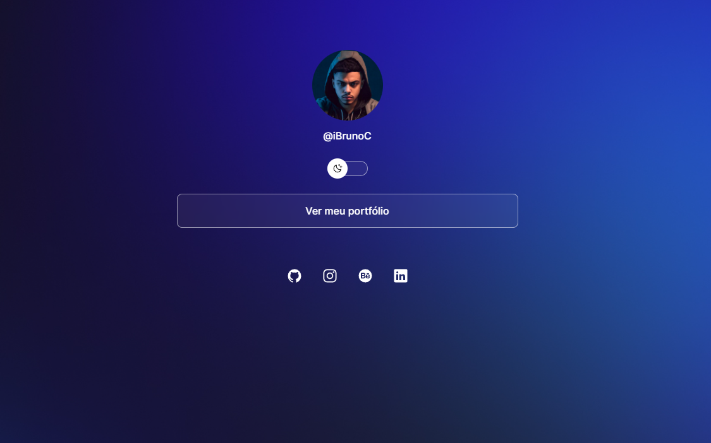

<h1 align="center">
DevLinks ( Rocketseat - Discover )
</h1>

“Seu próprio LinkThree”!</blockquote>

<h3 align="center">   
Um projeto feito no curso Discover da Rocketseat
</h3>
    

  <a href="#Tecnologias">Tecnologias usadas</a>&nbsp;&nbsp;&nbsp;|&nbsp;&nbsp;&nbsp;
  <a href="#Resultado">Resultado do projeto</a>

## Tecnologias

- [HTML](https://developer.mozilla.org/pt-BR/docs/Web/HTML)
- [CSS](https://developer.mozilla.org/pt-BR/docs/Web/CSS)
- [JavaScript](https://developer.mozilla.org/pt-BR/docs/Web/JavaScript)
- [Git](https://git-scm.com/docs)
- [VS Code](https://code.visualstudio.com/).

## Resultado

  

